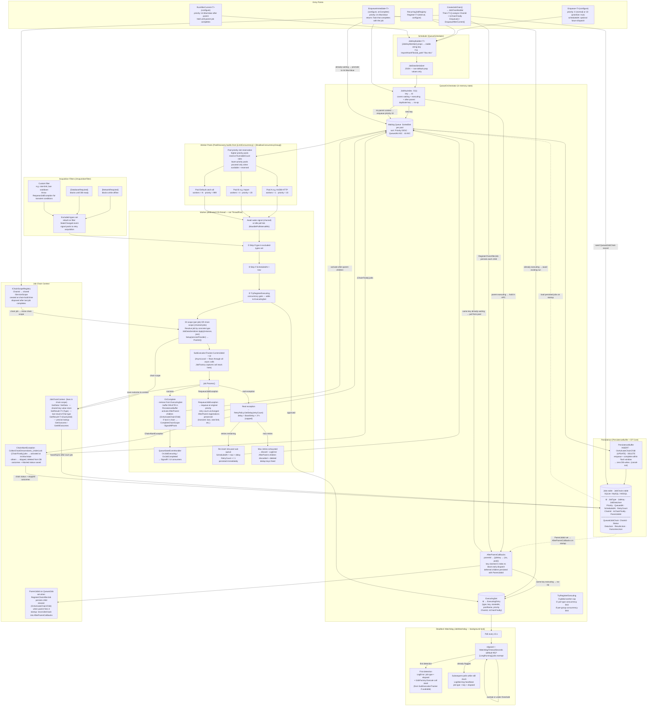
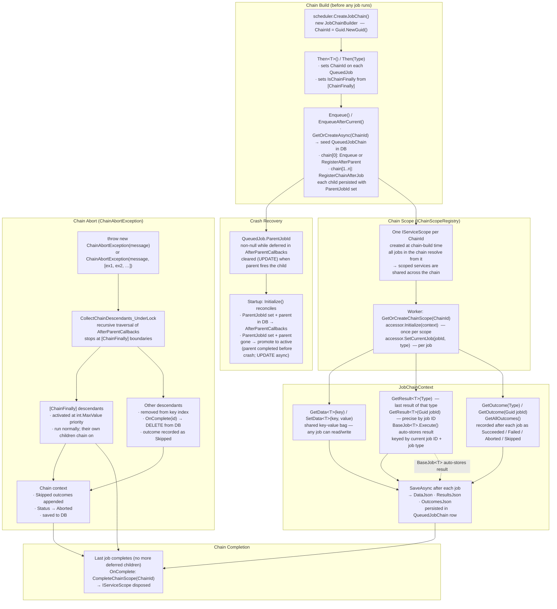

# Shoko.QueueProcessor

A lightweight, persistent, attribute-driven background job queue for .NET 10 applications. Extracted from [Shoko Server](https://github.com/ShokoAnime/ShokoServer) so plugins and other apps can use the same scheduler the server runs on.

[](https://www.nuget.org/packages/Shoko.QueueProcessor/)

---

## Why?

Most background job libraries either pull in a heavy runtime (Hangfire, Quartz) or hand you a `Channel<T>` and leave the rest as homework. `Shoko.QueueProcessor` sits in the middle:

- **Persistent** — jobs survive crashes (EF Core / SQLite / MySQL / SQL Server).
- **DI-native** — jobs are resolved from `IServiceProvider`; constructor injection just works.
- **Attribute-driven concurrency** — pools and worker counts come from `[LimitConcurrency]`, `[DisallowConcurrencyGroup]`, etc., not boilerplate.
- **Acquisition filters** — externally-gated jobs (network down, rate-limited, DB not ready) are held out of dispatch without consuming worker threads.
- **Dedup-by-key** — enqueueing the same logical job twice is a no-op.
- **Cheap when idle** — a job enqueued *and* completed inside the flush window never touches the database.

---

## Install

```bash
dotnet add package Shoko.QueueProcessor
```

Target framework: **.NET 10.0**.

---

## How it works



**The short version:**

1. You call `scheduler.Enqueue<MyJob>(j => j.FileId = 42)`.
2. A **stable key** is built from `[JobKeyMember]` properties (or all primitive props). If a job with that key is already waiting or executing, the call is a no-op.
3. The job is added to an in-memory waiting queue and queued for persistence via `PersistenceBuffer`. If it finishes within `FlushIntervalMs` (default 3s) it never touches the DB at all.
4. The orchestrator routes the job to the **worker pool** that handles its type. Pools are built at startup by `PoolDiscovery` from your `[LimitConcurrency]` / `[DisallowConcurrencyGroup]` attributes.
5. A worker calls **`IAcquisitionFilter.GetTypesToExclude()`** before picking a job. Network down? `NetworkRequired` jobs sit blocked without consuming the worker.
6. The worker resolves the job from DI (so your constructor injection works), applies the serialised property values, runs `Setup` → `PostInit` → `Process`.
7. On success, the row is deleted (batched). On exception, the `RetryPolicy` schedules a retry with exponential backoff — unless it's a `RequeueJobException`, in which case it goes back to the queue without incrementing the retry count (perfect for "AniDB banned, try again later").

---

## Wiring it into your app

In your host's `ConfigureServices`:

```csharp
using Shoko.QueueProcessor;

services.AddQueueProcessor(opts =>
{
    opts.Provider         = DatabaseProvider.SQLite;
    opts.ConnectionString = "Data Source=queue.db";

    // Concurrency
    opts.MaxTotalWorkers      = Environment.ProcessorCount + 4;
    opts.DefaultPoolMaxWorkers = 8;

    // Retry backoff (per-type override available via [RetryPolicy])
    opts.RetryMaxAttempts       = 8;
    opts.RetryBaseDelaySeconds  = 30;
    opts.RetryMaxDelaySeconds   = 3600;

    // PersistenceBuffer: short-lived jobs never hit disk
    opts.FlushIntervalMs = 3000;
    opts.MaxFlushBatch   = 500;

    // Runtime concurrency overrides (lowers a type's pool size; cannot exceed [LimitConcurrency])
    opts.LimitedConcurrencyOverrides["HashFileJob"] = 1;
});
```

`AddQueueProcessor` automatically scans the **calling assembly** for `IQueueJob` implementations. To scan additional assemblies (e.g. for plugins loaded out-of-process), pass them as the trailing params:

```csharp
services.AddQueueProcessor(configure: opts => { /* ... */ },
    scanAssemblies: typeof(MyPlugin).Assembly);
```

Or, from a plugin that loads *after* `AddQueueProcessor` has run (but before the host starts):

```csharp
services.AddQueueJobsFromAssembly(typeof(MyPluginJob).Assembly);
```

That's all the setup. `WorkerPoolManager` is registered as an `IHostedService` — when the host starts, it migrates the queue DB, loads persisted jobs, builds pools from attributes, and starts the workers.

---

## Creating a job

Implement `IQueueJob`:

```csharp
using System.Collections.Generic;
using System.Threading.Tasks;
using Microsoft.Extensions.Logging;
using Shoko.QueueProcessor.Abstractions;
using Shoko.QueueProcessor.Acquisition.Attributes;
using Shoko.QueueProcessor.Builder;
using Shoko.QueueProcessor.Concurrency;

[DatabaseRequired]                    // won't run until DB is ready
[NetworkRequired]                     // won't run while offline
[LimitConcurrency(2)]                 // shares a pool with max 2 workers
[JobKeyGroup("Import")]               // namespaces the key for readability
public class HashFileJob : IQueueJob
{
    private readonly IHashService _hashes;
    private ILogger<HashFileJob>? _logger;

    // Job data — settable props are serialised to JobDataJson
    [JobKeyMember("path", 0)]         // participates in the dedup key
    public string FilePath { get; set; } = string.Empty;

    public bool Force { get; set; }

    // Display-only — surfaced by the API / UI / SignalR
    public string TypeName => "Hash File";
    public string Title    => $"Hashing {System.IO.Path.GetFileName(FilePath)}";
    public Dictionary<string, object> Details => new() { ["Path"] = FilePath };

    // Required for the worker to deserialise without invoking your real ctor.
    // Make it protected/private — DI uses the injected ctor below.
    protected HashFileJob() { }

    // Real ctor — injected services land here.
    public HashFileJob(IHashService hashes) => _hashes = hashes;

    public void Setup(IServiceProvider sp) =>
        _logger = sp.GetRequiredService<ILogger<HashFileJob>>();

    public void PostInit() { /* state derived from FilePath, if needed */ }

    public async Task Process()
    {
        _logger?.LogInformation("Hashing {Path}", FilePath);
        await _hashes.HashAsync(FilePath, Force);
    }
}
```

### Key attributes

| Attribute | Purpose |
|---|---|
| `[LimitConcurrency(n, maxAllowed: m)]` | Caps simultaneous workers for this type (or group). `m` is the hard ceiling for runtime overrides. |
| `[DisallowConcurrencyGroup("name")]` | Puts this job into a shared pool with all other types in the same group. |
| `[DisallowConcurrentExecution]` | Shorthand for `[LimitConcurrency(1)]`. |
| `[Acquisition(priority: N)]` | Sets the pool's dispatch priority. Lower `N` = higher priority. Subclass to bundle priority with domain semantics (e.g. `[AniDBHttpRequired]`). Defaults to `AcquisitionAttribute.LowestPriority` (999) if absent. |
| `[RetryPolicy(MaxRetries = …, BaseDelaySeconds = …, MaxDelaySeconds = …)]` | Per-type override of the global retry backoff. |
| `[LongRunning]` | Exempts this job from the deadlock watchdog. Apply to jobs that are expected to run for a long time (e.g. hashing a large file, full-library scans). |
| `[DatabaseRequired]` | Job won't run while the database is unavailable. |
| `[NetworkRequired]` | Job won't run while the network is offline. Subclass to make custom gates (e.g. AniDB rate limit). |
| `[JobKeyGroup("name")]` | Namespaces the dedup key (`Import/HashFileJob_path:"…"`). |
| `[JobKeyMember(id, index)]` | Explicit field in the dedup key. Falls back to all primitive props if absent. |

### How dedup keys work

`JobKeyBuilder<T>` builds a string like `Import/HashFileJob_path:"/movies/foo.mkv"`. Two `Enqueue` calls that produce the same key collapse to one. If you have no `[JobKeyMember]` annotations, **all public settable primitive properties** participate, so two jobs with identical inputs naturally dedup.

### How job registration works

You don't manually register job types. `AddQueueProcessor` (and `AddQueueJobsFromAssembly`) reflect over assemblies, find every concrete `IQueueJob`, and:

1. Register it as **transient** in DI under its concrete type.
2. Add it to the shared `QueueJobTypeRegistry` (freezes on first read).
3. Feed the registry into `ConcurrencyRegistry` and `PoolDiscovery`, which build the pools.

The interface is used *only* for discovery — DI never resolves `IEnumerable<IQueueJob>`, so jobs aren't instantiated at startup.

---

## Enqueueing jobs

Inject `IQueueScheduler` (or `QueueHandler` for state queries) and call:

```csharp
// Fire and forget
await scheduler.Enqueue<HashFileJob>(j => j.FilePath = "/movies/foo.mkv");

// Prioritise (runs before priority 0 jobs)
await scheduler.Enqueue<HashFileJob>(j => j.FilePath = path, prioritize: true);

// Defer
await scheduler.Enqueue<CleanupJob>(scheduledAt: DateTimeOffset.UtcNow.AddHours(1));

// Convenience extension (same as Enqueue, named for the legacy Shoko call site)
await scheduler.StartJob<HashFileJob>(j => j.FilePath = path);

// Bulk
await scheduler.EnqueueRange(jobs);

// Remove a waiting job (no-op if already executing or not found)
await scheduler.Remove("Import/HashFileJob_path:\"/movies/foo.mkv\"");
await scheduler.Remove<HashFileJob>(j => j.FilePath = "/movies/foo.mkv"); // key built for you

// Control
await scheduler.Pause();
await scheduler.Resume();
await scheduler.Clear();    // wipes waiting (executing jobs run to completion)

// Inspect
var state = await scheduler.GetState();
Console.WriteLine($"{state.TotalExecuting} running, {state.TotalWaiting} waiting");
```

### Parent-child job chaining

#### Single follow-up: `RunAfterCurrent`

Use `RunAfterCurrent<T>` to register a follow-up job that is held until the currently-executing
job completes, then released at maximum priority. This prevents a successor from running against
partially-committed data written by its parent.

```csharp
// Called from inside a job's Process() — child runs after the parent finishes
await scheduler.RunAfterCurrent<IndexAnimeJob>(j => j.AnimeID = animeID);
```

| Scenario | Result |
|---|---|
| Called inside a job | Child is held; released at `int.MaxValue` priority when parent completes |
| Same key enqueued twice for same parent | Deduplicated — only one child runs |
| Child key already waiting in queue | Pulled from queue and held; re-inserted at max priority on parent completion |
| Child key already executing | No-op — the running instance is left alone |
| Parent fails (real failure / discard) | Child registrations discarded; dedup keys freed |
| Parent re-queues (`RequeueJobException`) | Child registrations preserved and fire on eventual success |
| Called outside a job context | Falls back to `Enqueue` at priority 10 |

`SubExecutionTracker` (internal) propagates the current job's ID via `AsyncLocal<Guid>` through
the full async call chain, so `RunAfterCurrent` works correctly when called from a helper
service method invoked by the job — not just from `Process()` directly.

#### Sequential chains: `CreateJobChain`

For longer sequences, build the full chain upfront with `CreateJobChain`. All parent-child
relationships are registered before any job executes, deferred children are persisted with
`ParentJobId` set so the chain survives a crash, and all jobs in the chain share a single DI
scope so scoped services (including `IJobChainContextAccessor`) are naturally shared.

```csharp
// Build a chain: A → B → C (C always runs, even if B aborts)
await scheduler.CreateJobChain()
    .Then<GetAniDBAnimeJob>(j => j.AnimeID = animeID)
    .Then<SearchTmdbJob>(j => j.AnimeID = animeID)
    .Then<FinalizeReleaseSearchJob>(j => j.AnimeID = animeID)  // [ChainFinally]
    .EnqueueAfterCurrent();  // or .Enqueue() to start independently
```



**Injecting chain context into a job:**

```csharp
// Producer job (BaseJob<T> — result stored automatically)
public class GetAniDBAnimeJob : BaseJob<AniDB_Anime>
{
    public int AnimeID { get; set; }

    public override async Task<AniDB_Anime> Process()
    {
        // … fetch from AniDB …
        return anime;  // automatically stored in chain context, keyed by this job's ID
    }
}

// Consumer job (reads the result set by the previous job)
public class SearchTmdbJob(IJobChainContextAccessor chain) : BaseJob
{
    public int AnimeID { get; set; }

    public override async Task Execute()
    {
        // By type (returns the most recent result of that type in the chain)
        var anime = chain.GetResult<GetAniDBAnimeJob, AniDB_Anime>();

        // If the same job type appears more than once, use the precise overload:
        // var anime = chain.GetResult<AniDB_Anime>(specificJobId);

        // Shared data bag — any job in the chain can read/write
        chain.SetData("tmdbSearchQuery", anime?.MainTitle);
        var previousQuery = chain.GetData<string>("tmdbSearchQuery");

        // Check what happened to a previous step
        var outcome = chain.GetCurrentContext()?.GetOutcome(typeof(GetAniDBAnimeJob));
    }
}
```

**Aborting a chain:**

```csharp
// Throw from any job to short-circuit the remaining non-finally steps
throw new ChainAbortException("Anime not found — nothing to match.");

// With aggregate causes
throw new ChainAbortException("Multiple providers failed", [ex1, ex2]);
```

**Always-run steps:**

```csharp
// Apply [ChainFinally] to a job that must always run, even after an abort.
// Its own children also run normally after it completes.
[ChainFinally]
public class FinalizeReleaseSearchJob : BaseJob
{
    public override async Task Execute()
    {
        var ctx = _chain.GetCurrentContext();
        // ctx.Status == ChainStatus.Aborted if chain was aborted
        // ctx.GetAllOutcomes() shows what ran, what was skipped
    }
}
```

### Recurring jobs

Resolve `RecurringJobRegistry` from DI:

```csharp
public class MyPluginStartup
{
    public MyPluginStartup(RecurringJobRegistry recurring)
    {
        recurring.Register<ImportSweepJob>(
            interval: TimeSpan.FromHours(1),
            configure: j => j.IncludeHidden = false,
            runImmediately: true);
    }
}
```

Registration is safe before *or* after `StartAsync` — late registrations arm immediately. If your job needs the DB, add `[DatabaseRequired]` and it'll naturally wait until the DB acquisition filter releases it.

---

## Acquisition filters

A filter says "while my condition holds, don't dispatch these job types." A worker that picks up a job whose type is excluded simply skips it — the slot is free for the next eligible job.

Bundled filters:

- `NetworkRequiredAcquisitionFilter` — gates `[NetworkRequired]` (and subclasses) on `IConnectivityService.NetworkAvailability`.

Implement your own by registering an `IAcquisitionFilter` in DI:

```csharp
public class MyRateLimitFilter : IAcquisitionFilter
{
    private static readonly Type[] _gated = [typeof(ExpensiveApiJob)];
    private readonly IRateLimiter _limiter;

    public MyRateLimitFilter(IRateLimiter limiter)
    {
        _limiter = limiter;
        _limiter.LimitChanged += (_, _) => StateChanged?.Invoke(this, EventArgs.Empty);
    }

    public Type? WatchedAttributeType => null;   // applies to all pools

    public IEnumerable<Type> GetTypesToExclude() =>
        _limiter.IsThrottled ? _gated : [];

    public event EventHandler? StateChanged;
}

services.AddSingleton<IAcquisitionFilter, MyRateLimitFilter>();
```

For transient conditions where retry-with-backoff is the wrong answer (rate limited, banned, briefly offline), throw `RequeueJobException` from `Process()`. The job returns to the waiting queue at its original priority, the retry count is *not* incremented, and the filter will naturally hold it until the condition clears.

---

## Pool priority

By default every pool has equal standing when competing for the global worker slots (`MaxTotalWorkers`). If some job types need to run ahead of others — for example, rate-limited API calls that must not be crowded out by bulk imports — annotate them with `[Acquisition(priority: N)]`:

```csharp
[Acquisition(priority: 10)]          // lower number = higher priority
[LimitConcurrency(1)]
[DisallowConcurrencyGroup("AniDB_HTTP")]
public class GetAniDBAnimeJob : IQueueJob { … }

[Acquisition(priority: 20)]
[LimitConcurrency(4)]
[DisallowConcurrencyGroup("AniDB_UDP")]
public class ProcessFileJob : IQueueJob { … }

// No [Acquisition] → priority 999 (LowestPriority), runs when slots remain
public class HashFileJob : IQueueJob { … }
```

**How slot reservation works:** before a lower-priority worker picks up a job, the orchestrator counts how many runnable jobs exist across all higher-priority pools, capped at each pool's `MaxWorkers`. That sum is the number of slots "reserved" for higher-priority work. The worker proceeds only when `available > reserved`.

Example — 10 `MaxTotalWorkers`, `AniDB_HTTP` (max 1), `AniDB_UDP` (max 4), `Default` (max 10):

| Higher-priority runnable | Reserved | Available | Default workers allowed |
|---|---|---|---|
| HTTP=1, UDP=4 | 5 | 10 | 5 |
| HTTP=0, UDP=2 | 2 | 10 | 8 |
| HTTP=0, UDP=0 | 0 | 10 | 10 |

The pool priority is the **minimum** `WorkerPriority` across all job types in the pool. Types without `[Acquisition]` default to `LowestPriority` (999).

---

## Events

`QueueStateEventHandler` (singleton) exposes `QueueStarted`, `QueuePaused`, `QueueItemsAdded`, and `ExecutingJobsChanged`. Subscribe from your SignalR hub, UI, or telemetry pipeline:

```csharp
public class QueueEventEmitter
{
    public QueueEventEmitter(QueueStateEventHandler events, IHubContext<QueueHub> hub)
    {
        events.ExecutingJobsChanged += async (_, e) =>
            await hub.Clients.All.SendAsync("queue.changed", e);
    }
}
```

For point-in-time inspection without events, use `QueueHandler.GetExecutingJobs()` / `GetJobs(maxCount, offset, excludeBlocked)`.

---

## Configuration reference

All knobs live on `QueueProcessorOptions`:

| Option | Default | What it does |
|---|---|---|
| `Provider` | `SQLite` | EF Core provider: `SQLite`, `MySQL`, `SqlServer`. |
| `ConnectionString` | `"Data Source=queue.db"` | Connection string for the queue DB. |
| `MaxTotalWorkers` | `Environment.ProcessorCount + 4` | Hard ceiling across all pools. |
| `DefaultPoolMaxWorkers` | `Environment.ProcessorCount + 4` | Workers in the catch-all `"Default"` pool. |
| `FlushIntervalMs` | `3000` | Idle flush interval. Jobs that finish within this window skip the DB entirely. |
| `MaxFlushBatch` | `500` | Force-flush threshold for the persistence buffer. |
| `RetryMaxAttempts` | `8` | Global retry limit (override per-type with `[RetryPolicy]`). |
| `RetryBaseDelaySeconds` | `30` | First retry delay. Backoff = `BaseDelay * 2^n`. |
| `RetryMaxDelaySeconds` | `3600` | Cap on the backoff delay. |
| `MaxIdlePollIntervalMs` | `5000` | Worker idle poll cadence for `ScheduledAt` checks. |
| `MetricsWindowSeconds` | `60` | Sliding window for the jobs/sec metric. |
| `MetricsRollingAvgSamples` | `100` | Rolling sample count for per-type execution time. |
| `WatchdogTimeoutSeconds` | `90` | Jobs running longer than this are flagged as possible deadlocks. Jobs with `[LongRunning]` are exempt. |
| `LimitedConcurrencyOverrides` | `{}` | `JobTypeName → maxWorkers`. Lowers a pool's concurrency at runtime (can't exceed `[LimitConcurrency]`'s `MaxAllowedConcurrentJobs`). |

---

## Deadlock watchdog

`JobWatchdog` runs as a background task (started by `WorkerPoolManager`) and polls executing
jobs every 15 seconds. Any job that has been running longer than `WatchdogTimeoutSeconds` (default
90s) and is not decorated with `[LongRunning]` triggers:

1. **One `LogError`** on first detection — includes the job type, elapsed time, and the call
   stack captured at the last `IJobFactory.Execute` entry point (if any). This is the event to
   forward to your error-tracking system for aggregation.
2. **Repeated `LogWarning`** on every subsequent poll — heartbeat that the job is still stuck.

Apply `[LongRunning]` to jobs that are expected to exceed the timeout by design:

```csharp
[LongRunning]
[LimitConcurrency(2)]
public class HashFileJob : IQueueJob { … }
```

The watchdog cannot obtain a managed stack trace of a running thread without suspending it
(unavailable in .NET Core). Instead, `JobFactory.Execute<T>` captures its call stack when
invoked from within a worker job and stores it in `SubExecutionTracker` keyed by the outer job's
ID. If the job is stuck inside an `IJobFactory.Execute` call, the first-detection error log will
include exactly where in the code that call originated.

---

## Persistence model

### `Jobs` table

| Column | Notes |
|---|---|
| `Id` (Guid) | Unique instance ID, never changes. |
| `JobType` | Assembly-qualified type name (interned in memory). |
| `JobKey` | Unique dedup key (also unique-indexed). |
| `JobDataJson` | Serialised public settable props (Newtonsoft.Json). |
| `Priority` | Higher first; FIFO within priority. |
| `QueuedAt` / `ScheduledAt` | Earliest-dispatch hint for deferred / retried jobs. |
| `RetryCount` | Persisted so crash-restart doesn't reset backoff. |
| `ChainId` (Guid?) | The chain this job belongs to; null for standalone jobs. |
| `IsChainFinally` | True when the job carries `[ChainFinally]` — it runs even if the chain aborts. |
| `ParentJobId` (Guid?) | Non-null while the job is deferred in `AfterParentCallbacks`. Cleared (UPDATE) the moment the parent fires it. Used at startup to reconstruct `AfterParentCallbacks` from DB. |

There's **no status column** — executing state lives only in memory. On crash-restart, in-flight jobs are re-dispatched from their surviving row. Jobs with `ParentJobId` set whose parent is still present are placed back into `AfterParentCallbacks`; those whose parent is already gone are promoted to the active queue.

### `JobChains` table

Stores the shared context for a chain. One row per `ChainId`, created when the chain is first built and updated after each job completes.

| Column | Notes |
|---|---|
| `ChainId` (Guid) | Primary key; matches `Jobs.ChainId`. |
| `Status` | `Active`, `Aborted`, or `Completed` (stored as int). |
| `DataJson` | JSON object of the shared key-value data store (`GetData` / `SetData`). |
| `ResultsJson` | JSON array of `{JobId, TypeKey, Json}` entries — typed results produced by `BaseJob<T>` jobs, keyed by job ID so the same type can appear multiple times in a chain without collision. |
| `OutcomesJson` | JSON array of `{JobId, JobType, Status, ExceptionMessage, StackTrace, CompletedAt}` entries — one per job that ran, was aborted, or was skipped. |
| `CreatedAt` / `UpdatedAt` | Timestamps. |

Migrations are applied automatically by `WorkerPoolManager.StartAsync` (which calls `serviceProvider.MigrateQueueDatabaseAsync`).

---

## Building & contributing

```bash
dotnet build Shoko.QueueProcessor
```

NuGet publication is wired into the Shoko Server release workflow (`.github/workflows/build-release.yml`, job `queue-nuget`): tagging a release as `Shoko.QueueProcessor-v*` publishes the package automatically.

Issues and PRs are welcome on the main [Shoko Server repository](https://github.com/ShokoAnime/ShokoServer).

---

## License

Same as Shoko Server — see [LICENSE](../LICENSE).
