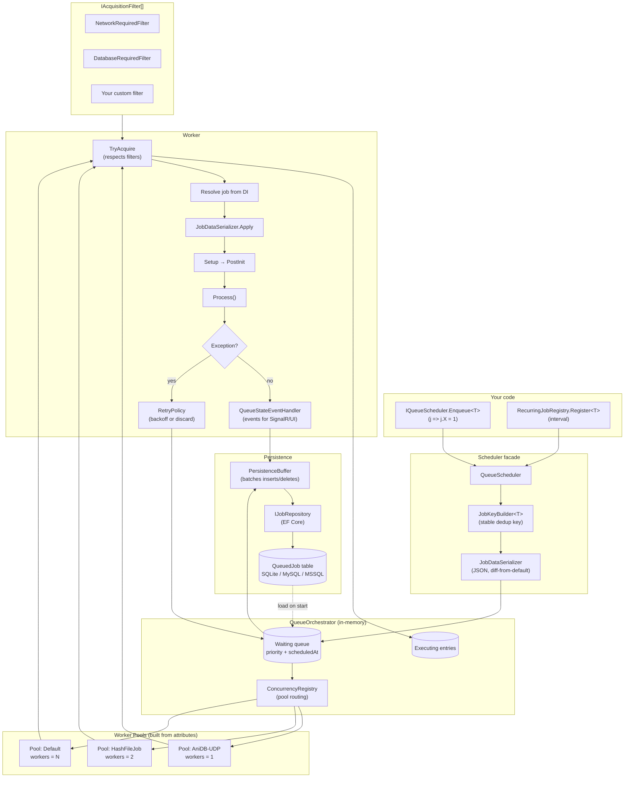

# Shoko.QueueProcessor

A lightweight, persistent, attribute-driven background job queue for .NET 10 applications. Extracted from [Shoko Server](https://github.com/ShokoAnime/ShokoServer) so plugins and other apps can use the same scheduler the server runs on.

[](https://www.nuget.org/packages/Shoko.QueueProcessor/)

---

## Why?

Most background job libraries either pull in a heavy runtime (Hangfire, Quartz) or hand you a `Channel<T>` and leave the rest as homework. `Shoko.QueueProcessor` sits in the middle:

- **Persistent** — jobs survive crashes (EF Core / SQLite / MySQL / SQL Server).
- **DI-native** — jobs are resolved from `IServiceProvider`; constructor injection just works.
- **Attribute-driven concurrency** — pools and worker counts come from `[LimitConcurrency]`, `[DisallowConcurrencyGroup]`, etc., not boilerplate.
- **Acquisition filters** — externally-gated jobs (network down, rate-limited, DB not ready) are held out of dispatch without consuming worker threads.
- **Dedup-by-key** — enqueueing the same logical job twice is a no-op.
- **Cheap when idle** — a job enqueued *and* completed inside the flush window never touches the database.

---

## Install

```bash
dotnet add package Shoko.QueueProcessor
```

Target framework: **.NET 10.0**.

---

## How it works



**The short version:**

1. You call `scheduler.Enqueue<MyJob>(j => j.FileId = 42)`.
2. A **stable key** is built from `[JobKeyMember]` properties (or all primitive props). If a job with that key is already waiting or executing, the call is a no-op.
3. The job is added to an in-memory waiting queue and queued for persistence via `PersistenceBuffer`. If it finishes within `FlushIntervalMs` (default 3s) it never touches the DB at all.
4. The orchestrator routes the job to the **worker pool** that handles its type. Pools are built at startup by `PoolDiscovery` from your `[LimitConcurrency]` / `[DisallowConcurrencyGroup]` attributes.
5. A worker calls **`IAcquisitionFilter.GetTypesToExclude()`** before picking a job. Network down? `NetworkRequired` jobs sit blocked without consuming the worker.
6. The worker resolves the job from DI (so your constructor injection works), applies the serialised property values, runs `Setup` → `PostInit` → `Process`.
7. On success, the row is deleted (batched). On exception, the `RetryPolicy` schedules a retry with exponential backoff — unless it's a `RequeueJobException`, in which case it goes back to the queue without incrementing the retry count (perfect for "AniDB banned, try again later").

---

## Wiring it into your app

In your host's `ConfigureServices`:

```csharp
using Shoko.QueueProcessor;

services.AddQueueProcessor(opts =>
{
    opts.Provider         = DatabaseProvider.SQLite;
    opts.ConnectionString = "Data Source=queue.db";

    // Concurrency
    opts.MaxTotalWorkers      = Environment.ProcessorCount + 4;
    opts.DefaultPoolMaxWorkers = 8;

    // Retry backoff (per-type override available via [RetryPolicy])
    opts.RetryMaxAttempts       = 8;
    opts.RetryBaseDelaySeconds  = 30;
    opts.RetryMaxDelaySeconds   = 3600;

    // PersistenceBuffer: short-lived jobs never hit disk
    opts.FlushIntervalMs = 3000;
    opts.MaxFlushBatch   = 500;

    // Runtime concurrency overrides (lowers a type's pool size; cannot exceed [LimitConcurrency])
    opts.LimitedConcurrencyOverrides["HashFileJob"] = 1;
});
```

`AddQueueProcessor` automatically scans the **calling assembly** for `IQueueJob` implementations. To scan additional assemblies (e.g. for plugins loaded out-of-process), pass them as the trailing params:

```csharp
services.AddQueueProcessor(configure: opts => { /* ... */ },
    scanAssemblies: typeof(MyPlugin).Assembly);
```

Or, from a plugin that loads *after* `AddQueueProcessor` has run (but before the host starts):

```csharp
services.AddQueueJobsFromAssembly(typeof(MyPluginJob).Assembly);
```

That's all the setup. `WorkerPoolManager` is registered as an `IHostedService` — when the host starts, it migrates the queue DB, loads persisted jobs, builds pools from attributes, and starts the workers.

---

## Creating a job

Implement `IQueueJob`:

```csharp
using System.Collections.Generic;
using System.Threading.Tasks;
using Microsoft.Extensions.Logging;
using Shoko.QueueProcessor.Abstractions;
using Shoko.QueueProcessor.Acquisition.Attributes;
using Shoko.QueueProcessor.Builder;
using Shoko.QueueProcessor.Concurrency;

[DatabaseRequired]                    // won't run until DB is ready
[NetworkRequired]                     // won't run while offline
[LimitConcurrency(2)]                 // shares a pool with max 2 workers
[JobKeyGroup("Import")]               // namespaces the key for readability
public class HashFileJob : IQueueJob
{
    private readonly IHashService _hashes;
    private ILogger<HashFileJob>? _logger;

    // Job data — settable props are serialised to JobDataJson
    [JobKeyMember("path", 0)]         // participates in the dedup key
    public string FilePath { get; set; } = string.Empty;

    public bool Force { get; set; }

    // Display-only — surfaced by the API / UI / SignalR
    public string TypeName => "Hash File";
    public string Title    => $"Hashing {System.IO.Path.GetFileName(FilePath)}";
    public Dictionary<string, object> Details => new() { ["Path"] = FilePath };

    // Required for the worker to deserialise without invoking your real ctor.
    // Make it protected/private — DI uses the injected ctor below.
    protected HashFileJob() { }

    // Real ctor — injected services land here.
    public HashFileJob(IHashService hashes) => _hashes = hashes;

    public void Setup(IServiceProvider sp) =>
        _logger = sp.GetRequiredService<ILogger<HashFileJob>>();

    public void PostInit() { /* state derived from FilePath, if needed */ }

    public async Task Process()
    {
        _logger?.LogInformation("Hashing {Path}", FilePath);
        await _hashes.HashAsync(FilePath, Force);
    }
}
```

### Key attributes

| Attribute | Purpose |
|---|---|
| `[LimitConcurrency(n, maxAllowed: m)]` | Caps simultaneous workers for this type (or group). `m` is the hard ceiling for runtime overrides. |
| `[DisallowConcurrencyGroup("name")]` | Puts this job into a shared pool with all other types in the same group. |
| `[DisallowConcurrentExecution]` | Shorthand for `[LimitConcurrency(1)]`. |
| `[RetryPolicy(MaxRetries = …, BaseDelaySeconds = …, MaxDelaySeconds = …)]` | Per-type override of the global retry backoff. |
| `[DatabaseRequired]` | Job won't run while the database is unavailable. |
| `[NetworkRequired]` | Job won't run while the network is offline. Subclass to make custom gates (e.g. AniDB rate limit). |
| `[JobKeyGroup("name")]` | Namespaces the dedup key (`Import/HashFileJob_path:"…"`). |
| `[JobKeyMember(id, index)]` | Explicit field in the dedup key. Falls back to all primitive props if absent. |

### How dedup keys work

`JobKeyBuilder<T>` builds a string like `Import/HashFileJob_path:"/movies/foo.mkv"`. Two `Enqueue` calls that produce the same key collapse to one. If you have no `[JobKeyMember]` annotations, **all public settable primitive properties** participate, so two jobs with identical inputs naturally dedup.

### How job registration works

You don't manually register job types. `AddQueueProcessor` (and `AddQueueJobsFromAssembly`) reflect over assemblies, find every concrete `IQueueJob`, and:

1. Register it as **transient** in DI under its concrete type.
2. Add it to the shared `QueueJobTypeRegistry` (freezes on first read).
3. Feed the registry into `ConcurrencyRegistry` and `PoolDiscovery`, which build the pools.

The interface is used *only* for discovery — DI never resolves `IEnumerable<IQueueJob>`, so jobs aren't instantiated at startup.

---

## Enqueueing jobs

Inject `IQueueScheduler` (or `QueueHandler` for state queries) and call:

```csharp
// Fire and forget
await scheduler.Enqueue<HashFileJob>(j => j.FilePath = "/movies/foo.mkv");

// Prioritise (runs before priority 0 jobs)
await scheduler.Enqueue<HashFileJob>(j => j.FilePath = path, prioritize: true);

// Defer
await scheduler.Enqueue<CleanupJob>(scheduledAt: DateTimeOffset.UtcNow.AddHours(1));

// Convenience extension (same as Enqueue, named for the legacy Shoko call site)
await scheduler.StartJob<HashFileJob>(j => j.FilePath = path);

// Bulk
await scheduler.EnqueueRange(jobs);

// Control
await scheduler.Pause();
await scheduler.Resume();
await scheduler.Clear();    // wipes waiting (executing jobs run to completion)

// Inspect
var state = await scheduler.GetState();
Console.WriteLine($"{state.TotalExecuting} running, {state.TotalWaiting} waiting");
```

### Recurring jobs

Resolve `RecurringJobRegistry` from DI:

```csharp
public class MyPluginStartup
{
    public MyPluginStartup(RecurringJobRegistry recurring)
    {
        recurring.Register<ImportSweepJob>(
            interval: TimeSpan.FromHours(1),
            configure: j => j.IncludeHidden = false,
            runImmediately: true);
    }
}
```

Registration is safe before *or* after `StartAsync` — late registrations arm immediately. If your job needs the DB, add `[DatabaseRequired]` and it'll naturally wait until the DB acquisition filter releases it.

---

## Acquisition filters

A filter says "while my condition holds, don't dispatch these job types." A worker that picks up a job whose type is excluded simply skips it — the slot is free for the next eligible job.

Bundled filters:

- `NetworkRequiredAcquisitionFilter` — gates `[NetworkRequired]` (and subclasses) on `IConnectivityService.NetworkAvailability`.

Implement your own by registering an `IAcquisitionFilter` in DI:

```csharp
public class MyRateLimitFilter : IAcquisitionFilter
{
    private static readonly Type[] _gated = [typeof(ExpensiveApiJob)];
    private readonly IRateLimiter _limiter;

    public MyRateLimitFilter(IRateLimiter limiter)
    {
        _limiter = limiter;
        _limiter.LimitChanged += (_, _) => StateChanged?.Invoke(this, EventArgs.Empty);
    }

    public Type? WatchedAttributeType => null;   // applies to all pools

    public IEnumerable<Type> GetTypesToExclude() =>
        _limiter.IsThrottled ? _gated : [];

    public event EventHandler? StateChanged;
}

services.AddSingleton<IAcquisitionFilter, MyRateLimitFilter>();
```

For transient conditions where retry-with-backoff is the wrong answer (rate limited, banned, briefly offline), throw `RequeueJobException` from `Process()`. The job returns to the waiting queue at its original priority, the retry count is *not* incremented, and the filter will naturally hold it until the condition clears.

---

## Events

`QueueStateEventHandler` (singleton) exposes `QueueStarted`, `QueuePaused`, `QueueItemsAdded`, and `ExecutingJobsChanged`. Subscribe from your SignalR hub, UI, or telemetry pipeline:

```csharp
public class QueueEventEmitter
{
    public QueueEventEmitter(QueueStateEventHandler events, IHubContext<QueueHub> hub)
    {
        events.ExecutingJobsChanged += async (_, e) =>
            await hub.Clients.All.SendAsync("queue.changed", e);
    }
}
```

For point-in-time inspection without events, use `QueueHandler.GetExecutingJobs()` / `GetJobs(maxCount, offset, excludeBlocked)`.

---

## Configuration reference

All knobs live on `QueueProcessorOptions`:

| Option | Default | What it does |
|---|---|---|
| `Provider` | `SQLite` | EF Core provider: `SQLite`, `MySQL`, `SqlServer`. |
| `ConnectionString` | `"Data Source=queue.db"` | Connection string for the queue DB. |
| `MaxTotalWorkers` | `Environment.ProcessorCount + 4` | Hard ceiling across all pools. |
| `DefaultPoolMaxWorkers` | `Environment.ProcessorCount + 4` | Workers in the catch-all `"Default"` pool. |
| `FlushIntervalMs` | `3000` | Idle flush interval. Jobs that finish within this window skip the DB entirely. |
| `MaxFlushBatch` | `500` | Force-flush threshold for the persistence buffer. |
| `RetryMaxAttempts` | `8` | Global retry limit (override per-type with `[RetryPolicy]`). |
| `RetryBaseDelaySeconds` | `30` | First retry delay. Backoff = `BaseDelay * 2^n`. |
| `RetryMaxDelaySeconds` | `3600` | Cap on the backoff delay. |
| `MaxIdlePollIntervalMs` | `5000` | Worker idle poll cadence for `ScheduledAt` checks. |
| `MetricsWindowSeconds` | `60` | Sliding window for the jobs/sec metric. |
| `MetricsRollingAvgSamples` | `100` | Rolling sample count for per-type execution time. |
| `LimitedConcurrencyOverrides` | `{}` | `JobTypeName → maxWorkers`. Lowers a pool's concurrency at runtime (can't exceed `[LimitConcurrency]`'s `MaxAllowedConcurrentJobs`). |

---

## Persistence model

One table, `QueuedJob`:

| Column | Notes |
|---|---|
| `Id` (Guid) | Unique instance ID, never changes. |
| `JobType` | Assembly-qualified type name (interned in memory). |
| `JobKey` | Unique dedup key (also unique-indexed). |
| `JobDataJson` | Serialised public settable props (Newtonsoft.Json). |
| `Priority` | Higher first; FIFO within priority. |
| `QueuedAt` / `ScheduledAt` | Earliest-dispatch hint for deferred / retried jobs. |
| `RetryCount` | Persisted so crash-restart doesn't reset backoff. |

There's **no status column** — executing state lives only in memory. On crash-restart, in-flight jobs are simply re-dispatched from the row that was never deleted.

Migrations are applied automatically by `WorkerPoolManager.StartAsync` (which calls `serviceProvider.MigrateQueueDatabaseAsync`).

---

## Building & contributing

```bash
dotnet build Shoko.QueueProcessor
```

NuGet publication is wired into the Shoko Server release workflow (`.github/workflows/build-release.yml`, job `queue-nuget`): tagging a release as `Shoko.QueueProcessor-v*` publishes the package automatically.

Issues and PRs are welcome on the main [Shoko Server repository](https://github.com/ShokoAnime/ShokoServer).

---

## License

Same as Shoko Server — see [LICENSE](../LICENSE).
